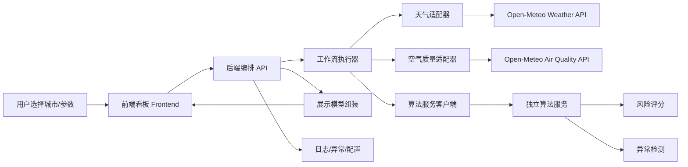

# 总体架构设计（Architecture）

## 1. 架构目标
本系统采用“前端展示 + 后端编排 + 外部数据接入 + 独立算法服务”的结构，目标是在控制实现复杂度的前提下，保证：
- 数据接口和算法接口可独立替换
- 工作流执行可配置
- 前后端职责清晰
- 文档、测试与异常处理具备企业项目基本规范

## 2. 总体架构图

## 3. 分层设计
### 3.1 展示层（Frontend）
职责：
- 城市选择与参数输入
- 展示天气、AQI、风险等级、趋势图和异常提示
- 处理加载态、空态、错误态

边界：
- 不直接调用第三方天气 / AQI 接口
- 不内嵌复杂风险评分规则

前端实现约束：
- 采用 Vue 3 + TypeScript + Vite
- 默认使用 Composition API 与 `<script setup lang="ts">`
- 页面组件作为编排层，复杂逻辑优先抽离到 composables
- 子组件通过 props / emits 明确数据流，避免隐式耦合

### 3.2 接口层（Router / API）
职责：
- 为前端暴露统一 HTTP 接口
- 按领域拆分 `dashboard router`、`analysis router`、`health router`
- 接收用户输入参数
- 调用工作流执行器并返回标准响应

边界：
- 不承载外部接口细节
- 不直接编写复杂分析逻辑

### 3.3 编排层（Workflow Engine）
职责：
- 管理主执行链路
- 控制并行调用和结果汇总
- 负责失败降级与执行状态流转

建议能力：
- 支持顺序步骤
- 支持并行步骤
- 支持参数注入
- 支持统一错误上下文

### 3.4 集成层（Adapters）
职责：
- 封装第三方天气和空气质量接口
- 统一超时、重试、错误映射
- 将第三方响应转为内部标准结构

边界：
- 不向前端暴露原始第三方字段
- 不承担最终展示模型组装

### 3.5 独立算法服务层（Algorithm Service）
职责：
- 接收标准化天气 / AQI 数据
- 计算风险评分
- 输出风险等级与影响因子
- 识别异常情况并生成标志位

边界：
- 不依赖前端视图结构
- 不直接关心第三方 API 细节

### 3.6 基础设施层（Infrastructure）
职责：
- 配置读取
- 日志记录
- 异常处理
- 环境变量管理
- 测试支撑

## 4. 核心模块说明
### 4.1 前端模块
- `DashboardPage`：页面容器与全局状态协调
- `CitySelector`：城市切换输入
- `ParameterPanel`：算法参数配置
- `MetricCards`：天气与 AQI 指标卡片
- `TrendChart`：趋势图表展示
- `RiskPanel`：风险评分与主因子展示
- `AlertPanel`：异常提示与降级信息

### 4.2 后端模块
- `health router`：提供 `/health` 健康检查入口
- `dashboard router`：提供 `/api/v1/dashboard/query` 看板编排入口
- `algorithm service client`：通过 HTTP 调用独立算法服务，并应用工作流中的 `analysisTimeoutMs` 超时配置
- `workflow engine`：控制“获取 -> 标准化 -> 分析 -> 组装”链路
- `weather adapter`：封装天气 API
- `air quality adapter`：封装 AQI API
- `local analysis fallback`：在远端算法服务不可用时，对风险评分与异常检测统一使用本地规则兜底
- `schemas`：统一请求 / 响应模型
- `config`：YAML 工作流与环境配置管理

### 4.3 独立算法服务模块
- `analysis router`：提供 `/score-risk`、`/detect-anomaly`
- `analysis engine`：封装风险评分与异常检测规则
- `schemas`：保持与编排服务一致的算法请求 / 响应结构

## 5. 数据流设计
### 5.1 主链路
1. 前端提交城市与算法参数。
2. 后端校验参数并启动工作流。
3. 工作流并行调用天气接口与 AQI 接口。
4. 适配层将返回结果转为标准内部模型。
5. `dashboard service` 根据标准模型组装 `AnalysisRiskRequest` 与 `AnalysisAnomalyRequest`，并透传运行时阈值与已支持的风险权重。
6. `backend` 通过算法服务客户端调用独立算法服务，并应用工作流中的 `analysisTimeoutMs`。
7. 若远端算法服务失败，后端统一切换到本地规则并将 `analysis` 状态标记为 `degraded`，随后组装展示模型。
8. 前端渲染卡片、图表和提示信息。

### 5.2 展示模型建议
展示模型至少应包括：
- 城市信息
- 当前天气摘要
- 当前 AQI 摘要
- 24 小时趋势数据
- 风险评分与风险等级
- 关键影响因子
- 异常标志与说明
- 数据源状态信息

## 6. 工作流设计原则
### 6.1 工作流目标
将“数据获取 -> 算法处理 -> 结果展示”抽象为可配置执行链路，而不是把所有逻辑硬编码在一个接口函数中。

### 6.2 建议流程
- Step 1：输入参数校验
- Step 2：并行获取天气数据与 AQI 数据
- Step 3：数据标准化与完整性校验
- Step 4：调用独立算法服务，并应用工作流中的 `analysisTimeoutMs`
- Step 5：在远端失败时，对风险评分与异常检测统一触发本地 fallback，并标记 `analysis=degraded`
- Step 6：组装展示模型
- Step 7：返回响应并记录执行日志

### 6.3 可配置项
- 默认城市
- 上游请求超时毫秒数
- 算法服务超时毫秒数（`analysisTimeoutMs`）
- 重试次数
- 风险阈值
- 风险权重（`aqiWeight`、`pm25Weight`、`pm10Weight`、`weatherWeight`）
- 异常窗口大小
- 是否启用未来 7 天趋势模块

## 7. 异常流设计
### 7.1 外部接口异常
- 超时：返回可识别错误码，并触发降级策略
- 非法响应：记录日志，标记数据源不可用
- 速率限制：返回业务友好提示，并建议稍后重试

### 7.2 算法服务异常
- 远端算法服务超时或失败：保留原始天气和 AQI 数据展示，对风险评分与异常检测统一回退到后端本地规则
- 发生上述降级时：`sourceStatus.analysis` 标记为 `degraded`

### 7.3 前端异常表现
- 全量失败：展示错误页与重试按钮
- 部分失败：展示可用模块，并对失败模块做局部提示
- 空数据：展示空态文案，不报系统错误

## 8. 扩展点设计
- 新增数据源：通过新增 adapter 实现，不改核心工作流接口
- 新增算法：通过新增 analysis service 子能力接入
- 新增页面模块：通过独立 view model 字段扩展，不破坏现有展示层
- 新增地图热力：作为前端增强模块接入，后端只补充区域维度数据

## 9. 非功能要求
- 可维护性：模块职责单一，接口清晰
- 可测试性：核心服务层与适配层可单独测试
- 可替换性：第三方接口可替换，算法规则可配置
- 可读性：文档、命名、目录结构清晰

## 10. 技术选型建议
- 前端：Vue 3 + TypeScript + Vite
- 后端：FastAPI
- 工作流配置：YAML
- 图表：ECharts
- 测试：pytest + Vitest
- 文档：Markdown

## 11. 文档与治理要求
该架构文档完成后，后续必须继续补齐：
- 外部 / 内部接口文档
- 数据契约文档
- Figma 复用说明
- 工作流定义文档
- 测试计划
- AI Skills 使用记录
- 代码审查报告
