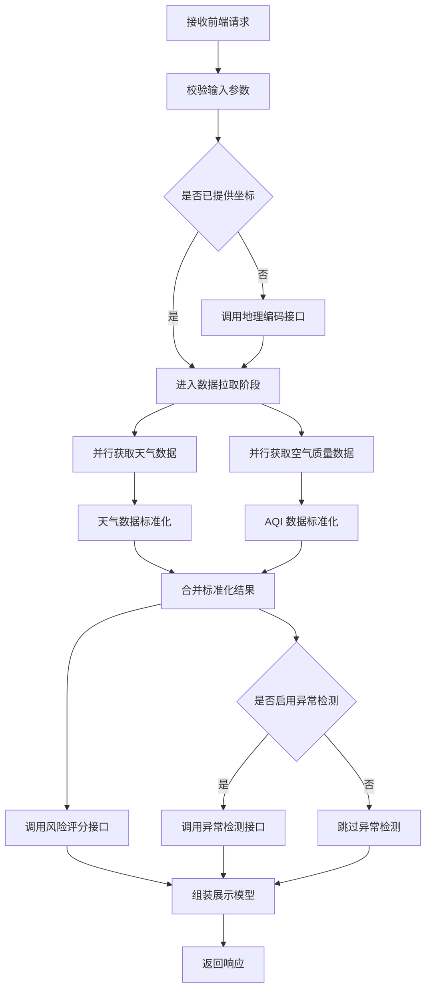

# 工作流设计说明（Workflow Design）

## 1. 文档目标
本文档定义“空气质量 / 天气联动分析看板”的可配置工作流，用于将：
- 数据获取
- 算法分析
- 视图模型组装
- 结果展示
串联为可编排、可追踪、可降级的执行链路。

## 2. 工作流设计原则
- 配置驱动，不把核心流程硬编码在单一函数中
- 上游数据获取与内部算法分析解耦
- 支持并行步骤，减少整体响应时间
- 支持局部失败和降级返回
- 支持参数化阈值和开关配置

## 3. 主工作流概览
**工作流名称**
- `main`

**工作流目标**
- 根据用户输入的城市或坐标，获取天气和空气质量信息，完成风险评分与异常检测，并返回前端展示模型。

**工作流模式**
- 顺序执行 + 并行执行 + 条件分支

## 4. 工作流主链路

## 5. 工作流分步骤说明

### Step 1：输入校验
**目标**
- 校验城市名、坐标、时区和工作流参数是否合法。

**输入**
- 前端请求体

**输出**
- 标准化请求对象

**校验项**
- 城市名与坐标不能同时为空
- 若提供坐标，纬度范围为 `[-90, 90]`，经度范围为 `[-180, 180]`
- `forecastDays` 建议为 `1-7`
- 风险阈值满足 `medium < high`

### Step 2：地理编码（条件步骤）
**触发条件**
- 当请求未直接提供坐标时执行

**目标**
- 将城市名转换为坐标与时区

**失败处理**
- 无结果时返回 `CITY_NOT_FOUND`
- 上游失败时返回可重试错误

### Step 3：天气与 AQI 并行拉取
**目标**
- 并行获取天气数据和空气质量数据，缩短整体等待时间。

**并行子步骤**
- `fetch_weather`
- `fetch_air_quality`

**超时控制**
- 每个上游请求独立超时
- 单个子步骤失败不立即终止整体流程，先标记状态，交由降级逻辑判断

### Step 4：数据标准化
**目标**
- 将上游响应字段映射为内部统一模型，避免上游字段直接污染业务逻辑和前端模型。

**标准化内容**
- 城市信息
- 当前天气摘要
- 当前 AQI 摘要
- 小时级时间序列
- 天级趋势摘要
- 数据源状态

**校验规则**
- 时间序列长度必须一致
- 数值字段缺失时给出默认值或标记不可用
- 上游单位统一写入元数据

### Step 5：风险评分
**目标**
- 对当前环境状态生成 `riskScore` 和 `riskLevel`

**输入**
- 当前天气数据
- 当前 AQI 数据
- 风险阈值与权重参数

**输出**
- 风险分数
- 风险等级
- 关键影响因子
- 风险摘要

### Step 6：异常检测（可选步骤）
**目标**
- 对小时级趋势进行突变和极值检测

**触发开关**
- `enableAnomalyDetection = true`

**输出**
- `hasAnomaly`
- `anomalyFlags`
- `severity`
- `messages`

### Step 7：视图模型组装
**目标**
- 将标准化结果、风险结果和异常结果拼装为前端可直接渲染的统一 ViewModel

**组装内容**
- 页面头部城市信息
- 当前指标卡片
- 趋势图数据
- 风险面板
- 异常提示面板
- 数据源状态提示
- 降级说明

## 6. 条件分支与降级逻辑
### 6.1 天气成功、AQI 失败
- 页面仍展示天气卡片和未来 7 天趋势
- 风险评分降级为“数据不足”
- 显示 AQI 数据源异常提示

### 6.2 AQI 成功、天气失败
- 页面仍展示空气质量卡片和 AQI 趋势
- 风险评分仅基于 AQI 生成简化结果
- 显示天气数据源异常提示

### 6.3 分析接口失败
- 原始天气和 AQI 数据正常展示
- 风险评分与异常模块显示“分析暂不可用”
- 记录 `traceId` 供后续排查

### 6.4 全量失败
- 返回错误页模型
- 提供重试动作

## 7. 配置项设计
| 配置项 | 类型 | 默认值 | 说明 |
|---|---|---:|---|
| `workflow.id` | string | `main` | 工作流标识 |
| `workflow.enableAnomalyDetection` | boolean | `true` | 是否启用异常检测 |
| `workflow.defaultForecastDays` | integer | `7` | 天气预测天数 |
| `workflow.defaultAirQualityForecastDays` | integer | `5` | AQI 预测天数 |
| `upstream.weather.timeoutMs` | integer | `5000` | 天气接口超时 |
| `upstream.airQuality.timeoutMs` | integer | `5000` | AQI 接口超时 |
| `analysis.timeoutMs` | integer | `2000` | 算法接口超时 |
| `risk.highThreshold` | integer | `70` | 高风险阈值 |
| `risk.mediumThreshold` | integer | `40` | 中风险阈值 |

## 8. 工作流状态跟踪
建议每次执行生成 `workflowRunId`，并记录以下状态：
- `received`
- `validated`
- `location_resolved`
- `weather_fetched`
- `air_quality_fetched`
- `normalized`
- `risk_scored`
- `anomaly_checked`
- `assembled`
- `completed`
- `degraded`
- `failed`

## 9. 日志与可观测性建议
- 记录 `traceId`
- 记录 `workflowRunId`
- 记录上游耗时
- 记录降级原因
- 记录风险评分输入摘要，不记录敏感信息

## 10. YAML 工作流落地说明
本项目使用 `workflows/main.yaml` 描述工作流结构。代码层只解释和执行配置，不在业务层重新写一套流程逻辑。

## 11. 与前端交互关系
前端并不关心工作流内部细节，只通过：
- 城市选择
- 参数配置
- 触发查询
来驱动后端执行工作流。

前端只依赖最终的展示模型和数据源状态，不直接处理第三方原始响应结构。